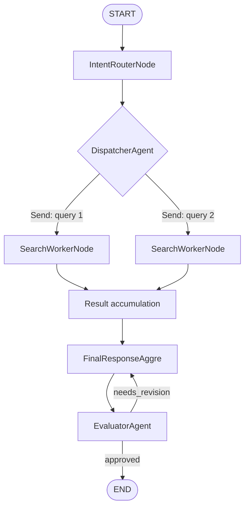
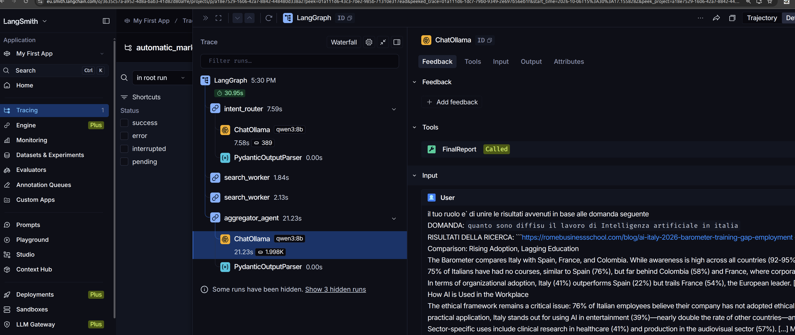
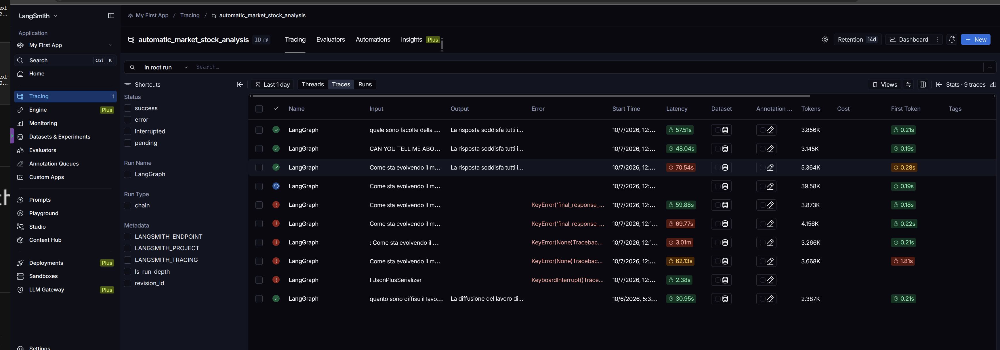
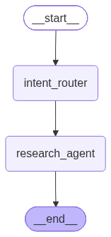
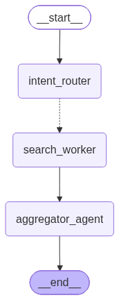
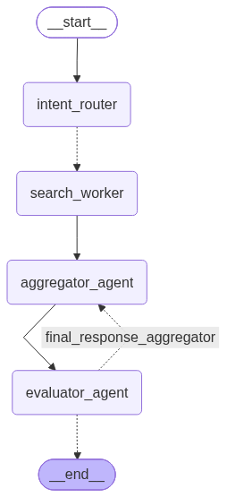

# Automatic Market & Stock Analysis

Sistema agentico sperimentale per la **ricerca automatizzata, classificazione, raccolta di fonti, sintesi e validazione di informazioni di mercato**, costruito con **LangGraph**, **LangChain/Ollama**, **Tavily**, **Pydantic** e **LangSmith**.

> **Stato del progetto:** prototipo / proof of concept.  
> Il repository implementa oggi il nucleo di una pipeline di *automated research* e *market intelligence*. Il nome del progetto anticipa l'obiettivo di evolvere verso l'analisi automatica di mercati e titoli azionari, ma l'implementazione corrente non integra ancora un provider specializzato di quotazioni, fondamentali, bilanci o serie storiche finanziarie.

---

## Indice

- [1. Obiettivo del progetto](#1-obiettivo-del-progetto)
- [2. Cosa fa il sistema](#2-cosa-fa-il-sistema)
- [3. Architettura agentica](#3-architettura-agentica)
- [4. Tassonomia dei pattern agentici](#4-tassonomia-dei-pattern-agentici)
- [5. Tassonomia semantica delle richieste](#5-tassonomia-semantica-delle-richieste)
- [6. Flusso di elaborazione](#6-flusso-di-elaborazione)
- [7. Stato condiviso e contratti dati](#7-stato-condiviso-e-contratti-dati)
- [8. Componenti principali](#8-componenti-principali)
- [9. Framework e tecnologie](#9-framework-e-tecnologie)
- [10. Struttura del repository](#10-struttura-del-repository)
- [11. Configurazione](#11-configurazione)
- [12. Installazione](#12-installazione)
- [13. Avvio](#13-avvio)
- [14. Esempio di esecuzione](#14-esempio-di-esecuzione)
- [15. Parallelizzazione delle ricerche](#15-parallelizzazione-delle-ricerche)
- [16. Structured Output e validazione](#16-structured-output-e-validazione)
- [17. Evaluator-Optimizer e ciclo di revisione](#17-evaluator-optimizer-e-ciclo-di-revisione)
- [18. Dependency Injection e separazione delle responsabilità](#18-dependency-injection-e-separazione-delle-responsabilità)
- [19. Osservabilità con LangSmith](#19-osservabilità-con-langsmith)
- [20. Grafi disponibili](#20-grafi-disponibili)
- [21. Testing e validazione](#21-testing-e-validazione)
- [22. Sicurezza e gestione dei segreti](#22-sicurezza-e-gestione-dei-segreti)
- [23. Limiti dell'implementazione corrente](#23-limiti-dellimplementazione-corrente)
- [24. Evoluzione verso una vera piattaforma di stock analysis](#24-evoluzione-verso-una-vera-piattaforma-di-stock-analysis)
- [25. Principi architetturali](#25-principi-architetturali)
- [26. Licenza](#26-licenza)

---

## 1. Obiettivo del progetto

`automatic_market_stock_analysis` nasce come base architetturale per un sistema capace di automatizzare parte del processo di **ricerca e analisi informativa** che precede una valutazione di mercato.

L'idea principale è non affidare l'intera attività a un singolo prompt monolitico, ma suddividere il processo in componenti specializzati e coordinati da un grafo di esecuzione.

Il sistema deve essere in grado di:

1. ricevere una domanda in linguaggio naturale;
2. comprenderne l'intento principale;
3. classificare la richiesta secondo una tassonomia definita;
4. trasformare la domanda in una o più query di ricerca;
5. distribuire dinamicamente le query a worker di ricerca;
6. raccogliere i risultati provenienti da più rami;
7. sintetizzare le evidenze in una risposta unica;
8. sottoporre la risposta a un evaluator indipendente;
9. richiedere una revisione della risposta quando la qualità non è sufficiente;
10. rendere osservabile l'intero processo tramite tracing.

L'architettura è quindi pensata come una **pipeline agentica controllata**, nella quale classificazione, ricerca, sintesi e valutazione sono responsabilità distinte.

### Obiettivo a lungo termine

L'obiettivo naturale del progetto è evolvere da un motore di *web research* generalista a una piattaforma di **market intelligence e stock analysis**, integrando in futuro dati strutturati come:

- quotazioni azionarie;
- serie storiche OHLCV;
- volumi;
- indicatori tecnici;
- fondamentali societari;
- bilanci;
- earnings;
- guidance;
- macroeconomia;
- news finanziarie;
- sentiment;
- confronto tra società e settori;
- indicatori di rischio;
- fonti regolamentari e filing ufficiali.

L'implementazione attuale costituisce soprattutto il **layer agentico di orchestrazione e ricerca** sul quale questi moduli possono essere aggiunti.

---

## 2. Cosa fa il sistema

Il comportamento attualmente implementato può essere riassunto come segue:

```text
User Query
    │
    ▼
Intent Router
    │
    ├── classificazione semantica
    └── generazione di 1-2 query di ricerca
    │
    ▼
Dispatcher
    │
    ├── Send(query 1) ──► Search Worker ──┐
    └── Send(query 2) ──► Search Worker ──┤
                                         │
                                         ▼
                                   Result Reducer
                                         │
                                         ▼
                                      Aggregator
                                         │
                                         ▼
                                      Evaluator
                                      /       \
                              approved         needs_revision
                                 │                    │
                                 ▼                    └────► Aggregator
                                END                         con feedback
```

In termini di responsabilità:

- **Intent Router**: comprende e struttura la richiesta;
- **Dispatcher**: genera dinamicamente il fan-out dei task;
- **Search Worker**: interroga Tavily;
- **Reducer**: accumula i risultati dei worker nello stato LangGraph;
- **Aggregator**: sintetizza i risultati;
- **Evaluator**: valuta la qualità della risposta;
- **Conditional Router**: decide se terminare o richiedere una revisione.

---

## 3. Architettura agentica

Il progetto usa **LangGraph** per modellare l'elaborazione come un grafo a stato.



Il grafo viene costruito nel file:

```text
test/test_ollama.py
```

tramite:

```python
builder = StateGraph(RouterState)
```

I nodi attualmente registrati sono:

```text
intent_router
search_worker
aggregator_agent
evaluator_agent
```

Il sistema combina edge normali ed edge condizionali.

---

## 4. Tassonomia dei pattern agentici

Una caratteristica centrale del progetto è l'uso combinato di più pattern agentici.

### 4.1 Router Pattern

Implementato principalmente da:

```text
src/agents/intent_router_node.py
```

Il router analizza la domanda e produce un oggetto `Classification` strutturato.

Il suo compito non è rispondere direttamente all'utente, ma stabilire:

- la categoria della richiesta;
- le query necessarie per la ricerca successiva;
- una motivazione della classificazione.

Questo separa la fase di **decisione** dalla fase di **esecuzione**.

---

### 4.2 Dynamic Planning

Il router genera a runtime da **1 a 2 query di ricerca**.

Di conseguenza, il numero e il contenuto dei task non sono completamente hard-coded.

Il piano viene rappresentato principalmente da:

```python
Classification(
    type_of_request=...,
    query_reformulate=[...],
    reasoning=...
)
```

Si tratta di una forma leggera di planning dinamico: il modello stabilisce quali ricerche effettuare prima che i worker vengano creati.

---

### 4.3 Orchestrator-Workers

Il pattern **Orchestrator-Workers** viene realizzato attraverso la combinazione di:

- `IntentRouterNode`;
- `DispatcherAgent`;
- `Send` di LangGraph;
- `SearchWorkerNode`.

Il dispatcher legge il piano generato dal router e crea un task separato per ciascuna query.

```python
Send("search_worker", {
    "search_query": query,
    "intent_type": classification.type_of_request
})
```

I worker condividono la stessa logica ma ricevono input differenti.

---

### 4.4 Parallelization / Fan-out

Il fan-out viene implementato tramite:

```python
from langgraph.types import Send
```

Per ogni query generata viene creato un `Send` indipendente verso `search_worker`.

Questo consente a LangGraph di trattare le ricerche come rami separati del grafo.

La parallelizzazione appartiene quindi al livello di **orchestrazione LangGraph**, non alla classe `TavilySearch` stessa.

---

### 4.5 Fan-in / Reducer

I risultati provenienti da più worker devono essere ricombinati.

Questo viene realizzato nello stato attraverso:

```python
results: Annotated[list[AgentOutput], operator.add]
```

`operator.add` agisce come reducer e permette di concatenare i risultati prodotti dai diversi rami.

Il modello implementa quindi una struttura:

```text
fan-out  → workers paralleli → fan-in
```

---

### 4.6 Synthesizer / Aggregator

`FinalResponseAggre` riceve il materiale raccolto dai worker e lo trasforma in una risposta unificata.

Il nodo:

1. concatena i risultati;
2. conserva gli URL presenti nelle evidenze;
3. costruisce un prompt di sintesi;
4. richiede un output tipizzato `FinalReport`;
5. salva il risultato in `final_answer`.

---

### 4.7 Evaluator-Optimizer

La coppia:

```text
FinalResponseAggre
        ↕
EvaluatorAgent
```

implementa il pattern **Evaluator-Optimizer**.

L'aggregator produce una risposta candidata. L'evaluator verifica poi se la risposta:

1. risponde alla domanda;
2. cita le fonti;
3. è coerente.

L'output dell'evaluator è strutturato come:

```python
Literal["approved", "needs_revision"]
```

Se il risultato è `needs_revision`, il grafo può tornare all'aggregator passando il feedback ricevuto.

---

### 4.8 Reflection / Feedback Loop

La revisione non consiste semplicemente nel ripetere lo stesso prompt.

Quando è disponibile un feedback negativo, l'aggregator incorpora:

- la risposta precedente;
- il feedback del validator;
- la domanda originale;
- i risultati della ricerca.

Questo realizza un semplice meccanismo di **reflection guidata da feedback**.

---

### 4.9 Guardrail contro loop infiniti

Il modello di stato prevede:

```python
revision_count: int
```

con l'intenzione di limitare il numero massimo di revisioni e impedire cicli infiniti tra aggregator ed evaluator.

> **Nota sullo stato attuale:** il meccanismo è concettualmente presente ma la sua implementazione deve essere verificata/corretta prima di considerarlo un guardrail affidabile; vedere la sezione [Testing e validazione](#21-testing-e-validazione).

---

### 4.10 Structured Output

Il progetto evita, nei passaggi decisionali più importanti, di dipendere da testo libero non validato.

Viene utilizzato:

```python
ChatOllama.with_structured_output(schema)
```

insieme a modelli Pydantic.

Gli output principali tipizzati sono:

- `Classification`;
- `FinalReport`;
- `Feedback`;
- `SearchResults`.

Questo rende il grafo più deterministico e riduce errori di parsing.

---

### 4.11 Strategy / Adapter

Il codice applicativo non dipende direttamente in ogni punto da Ollama o Tavily.

Sono presenti interfacce astratte:

```text
ILLMRouter
ITavilySearch
IEvaluator
```

con implementazioni concrete:

```text
OllamaRouter
TavilySearch
Evaluator
```

Questo permette di sostituire un provider senza modificare necessariamente la logica dei nodi agentici.

---

### 4.12 Dependency Injection

Le dipendenze vengono passate esplicitamente ai costruttori.

Esempio:

```python
intent_router = IntentRouterNode(OllamaRouter(appsettings))
search_worker = SearchWorkerNode(TavilySearch(appsettings))
aggregator_agent = FinalResponseAggre(OllamaRouter(appsettings))
evaluator_agent = EvaluatorAgent(Evaluator(OllamaRouter(appsettings)))
```

I nodi non creano autonomamente i provider esterni: li ricevono dall'esterno.

---

## 5. Tassonomia semantica delle richieste

Oltre alla tassonomia dei pattern agentici, il progetto contiene una seconda tassonomia: quella usata dal classificatore per determinare la natura della domanda.

In `src/domain/models.py`:

```python
Category = Literal[
    "technology",
    "economics",
    "jobs",
    "sport",
    "scientific_research"
]
```

| Categoria | Significato operativo | Esempio |
|---|---|---|
| `technology` | tecnologia, AI, software, innovazione | "Come sta evolvendo il mercato dei modelli AI open source?" |
| `economics` | economia, mercato, fenomeni macro/microeconomici | "Qual è l'andamento del settore EV in Europa?" |
| `jobs` | occupazione, professioni, mercato del lavoro | "Come cambia la domanda di sviluppatori AI?" |
| `sport` | informazioni e fenomeni sportivi | "Quali sono i trend economici nel calcio europeo?" |
| `scientific_research` | letteratura e ricerca scientifica | "Quali studi recenti analizzano gli agenti LLM?" |

Il router deve scegliere **una sola categoria** per ogni richiesta.

Successivamente genera da una a due query in inglese per migliorare la ricerca sul web.

### Nota rispetto al dominio finanziario

La tassonomia corrente è generalista e non è ancora una tassonomia finanziaria specifica.

Per una vera piattaforma di stock analysis potrebbe essere estesa con categorie come:

```text
company_fundamentals
market_price_action
earnings
macro_economics
sector_analysis
news_and_events
risk
valuation
technical_analysis
regulatory_filings
sentiment
```

Questa estensione non è ancora implementata nel codice attuale.

---

## 6. Flusso di elaborazione

### Passo 1 — Input utente

Il grafo riceve uno stato iniziale:

```python
{"query": domanda}
```

La query è il punto di ingresso dell'intero processo.

---

### Passo 2 — Intent Router

`IntentRouterNode` costruisce un prompt che chiede al modello di:

- classificare la richiesta;
- selezionare una categoria;
- generare da una a due query di ricerca;
- produrre un output compatibile con `Classification`.

Output:

```python
{
    "classification": Classification(...)
}
```

---

### Passo 3 — Dispatcher

`DispatcherAgent` legge:

```python
state["classification"]
```

e genera un `Send` per ogni elemento di:

```python
classification.query_reformulate
```

Il numero dei worker è quindi deciso a runtime.

---

### Passo 4 — Search Worker

Ogni `SearchWorkerNode` riceve un `SendTask`:

```python
{
    "search_query": "...",
    "intent_type": "economics"
}
```

Il worker delega la ricerca a un'istanza che implementa:

```python
ITavilySearch
```

L'implementazione corrente è:

```python
TavilySearch
```

---

### Passo 5 — Tavily

`TavilySearch.search_invoke()` invia la query al client Tavily.

Per impostazione predefinita:

```python
max_results = 2
```

Ogni risultato viene convertito in:

```python
SearchResults(
    title=...,
    url=...,
    content=...
)
```

---

### Passo 6 — Accumulo dei risultati

Ogni worker restituisce:

```python
{"results": results}
```

LangGraph aggrega i contributi grazie al reducer:

```python
Annotated[list[AgentOutput], operator.add]
```

---

### Passo 7 — Aggregator

`FinalResponseAggre` combina i contenuti in un unico blocco informativo.

Chiede poi all'LLM di produrre una risposta:

- coerente;
- unificata;
- strutturata;
- collegata alla domanda originale;
- corredata dagli URL delle fonti.

L'output viene validato come `FinalReport`.

---

### Passo 8 — Evaluator

`EvaluatorAgent` sottopone la risposta a un secondo passaggio di valutazione.

La risposta viene giudicata secondo tre criteri esplicitamente presenti nel codice:

1. risponde alla domanda?
2. cita le fonti?
3. è coerente?

L'evaluator restituisce un `Feedback`.

---

### Passo 9 — Conditional Routing

`routing_validator_node` decide il passo successivo.

```text
approved
   │
   ▼
  END
```

oppure:

```text
needs_revision
      │
      ▼
Aggregator
      │
      ▼
Evaluator
```

---

## 7. Stato condiviso e contratti dati

Il cuore del grafo è `RouterState`.

```python
class RouterState(TypedDict, total=False):
    query: str
    classification: Classification
    results: Annotated[list[AgentOutput], operator.add]
    final_answer: str
    grade: str
    feedback: str
    revision_count: int
```

### Significato dei campi

| Campo | Produttore | Consumatore | Funzione |
|---|---|---|---|
| `query` | input | router, aggregator, evaluator | domanda originale |
| `classification` | intent router | dispatcher | categoria + query generate |
| `results` | search worker | aggregator | evidenze raccolte |
| `final_answer` | aggregator | evaluator / output | risposta candidata/finale |
| `grade` | evaluator | routing | decisione di qualità |
| `feedback` | evaluator | aggregator | istruzioni per la revisione |
| `revision_count` | guardrail | routing | limite previsto alle revisioni |

La presenza di uno stato condiviso esplicito rende il flusso più leggibile rispetto a una catena di funzioni che si passano oggetti non formalizzati.

---

## 8. Componenti principali

### `IntentRouterNode`

**File:**

```text
src/agents/intent_router_node.py
```

**Responsabilità:**

- interpretare la domanda;
- classificare l'intento;
- generare query di ricerca;
- restituire `Classification`.

**Dipendenza:** `ILLMRouter`.

---

### `DispatcherAgent`

**File:**

```text
src/agents/dispatcher_agent.py
```

**Responsabilità:**

- leggere il piano del router;
- creare un task per ogni query;
- usare `Send` per il fan-out dinamico.

---

### `SearchWorkerNode`

**File:**

```text
src/agents/search_node.py
```

**Responsabilità:**

- ricevere una singola query;
- interrogare il provider di ricerca;
- normalizzare l'output per lo stato del grafo.

**Dipendenza:** `ITavilySearch`.

---

### `TavilySearch`

**File:**

```text
src/infrastructure/tavily_search.py
```

**Responsabilità:**

- integrare il client Tavily;
- effettuare la ricerca web;
- convertire i risultati esterni nel modello interno `SearchResults`.

Questo componente è un **adapter infrastrutturale**.

---

### `FinalResponseAggre`

**File:**

```text
src/agents/final_response_aggregator.py
```

**Responsabilità:**

- fondere i risultati dei worker;
- mantenere il contesto della domanda;
- incorporare eventuale feedback di revisione;
- generare `FinalReport`.

---

### `EvaluatorAgent`

**File:**

```text
src/agents/evalutor_agent.py
```

**Responsabilità:**

- costruire il prompt di valutazione;
- verificare la risposta candidata;
- produrre `Feedback`;
- alimentare il routing di revisione.

---

### `Evaluator`

**File:**

```text
src/infrastructure/evaluator.py
```

**Responsabilità:**

- adattare `ILLMRouter` al contratto `IEvaluator`;
- richiedere un output strutturato per la valutazione.

---

### `OllamaRouter`

**File:**

```text
src/infrastructure/llm.py
```

**Responsabilità:**

- configurare `ChatOllama`;
- esporre un'interfaccia comune per output strutturati;
- isolare il resto dell'applicazione dal client LLM concreto.

Configurazione attuale:

```python
temperature = 0.0
```

La temperatura zero è coerente con l'obiettivo di rendere classificazione e valutazione più stabili.

---

### `AppSettings`

**File:**

```text
src/config/app_settings.py
```

Centralizza la configurazione tramite `pydantic-settings`.

Legge automaticamente il file `.env` e ignora variabili aggiuntive non dichiarate.

---

### Interfacce

Directory:

```text
src/interfaces/
```

Contiene i contratti astratti:

```text
ILLMRouter
ITavilySearch
IEvaluator
```

Sono inoltre presenti interfacce sperimentali per tool tematici in `i_tools.py`.

---

## 9. Framework e tecnologie

### Python

Il progetto richiede:

```text
Python >= 3.10
```

come definito in `pyproject.toml`.

---

### LangGraph

È il framework di orchestrazione principale.

Viene utilizzato per:

- definire lo `StateGraph`;
- registrare i nodi;
- collegare gli edge;
- creare routing condizionale;
- effettuare fan-out dinamico con `Send`;
- aggregare lo stato prodotto da rami multipli.

---

### LangChain / LangChain Ollama

`langchain-ollama` viene usato per integrare Ollama tramite:

```python
ChatOllama
```

L'LLM viene utilizzato principalmente per:

- classificazione;
- query reformulation;
- sintesi;
- valutazione.

---

### Ollama

Ollama è il runtime LLM configurato nel progetto.

Default definiti in `AppSettings`:

```text
OLLAMA_BASE_URL=http://localhost:11434
OLLAMA_MODEL=qwen3:8b
```

Il modello può essere sostituito tramite variabili d'ambiente senza modificare il codice.

---

### Pydantic

Pydantic viene utilizzato per definire i principali contratti di output:

- classificazione;
- risultati di ricerca;
- report finale;
- feedback.

L'uso di `BaseModel` consente di introdurre vincoli e validazione strutturale.

---

### Pydantic Settings

`pydantic-settings` centralizza la lettura della configurazione esterna.

Ciò evita di disseminare accessi diretti alle variabili d'ambiente nei singoli nodi.

---

### Tavily

Tavily è il provider di web search attualmente utilizzato.

Il provider è incapsulato dietro l'interfaccia:

```text
ITavilySearch
```

Questo rende possibile introdurre in futuro provider alternativi.

---

### LangSmith

LangSmith è predisposto per il tracing delle esecuzioni LangChain/LangGraph.

Le variabili di configurazione presenti sono:

```text
LANGSMITH_TRACING
LANGSMITH_ENDPOINT
LANGSMITH_API_KEY
LANGSMITH_PROJECT
```

L'osservabilità è particolarmente importante in un sistema agentico perché permette di analizzare:

- durata dei nodi;
- input/output dei passaggi;
- errori;
- numero di chiamate LLM;
- comportamento dei worker;
- cicli di revisione;
- regressioni tra versioni.

---

## 10. Struttura del repository

La struttura significativa del progetto è:

```text
automatic_market_stock_analysis/
│
├── README.md
├── pyproject.toml
├── requirements.txt
│
├── graphs/
│   ├── graph.png
│   ├── graph_orhestratore.png
│   ├── graph_orhestratore_evaluator.png
│   ├── langsmith.png
│   └── langsmith_graphs.png
│
├── src/
│   ├── __init__.py
│   │
│   ├── agents/
│   │   ├── __init__.py
│   │   ├── dispatcher_agent.py
│   │   ├── evalutor_agent.py
│   │   ├── final_response_aggregator.py
│   │   ├── intent_router_node.py
│   │   ├── routing.py
│   │   └── search_node.py
│   │
│   ├── config/
│   │   ├── __init__.py
│   │   └── app_settings.py
│   │
│   ├── domain/
│   │   ├── __init__.py
│   │   ├── models.py
│   │   └── search.py
│   │
│   ├── infrastructure/
│   │   ├── __init__.py
│   │   ├── evaluator.py
│   │   ├── llm.py
│   │   ├── tavily_search.py
│   │   └── tools.py
│   │
│   ├── interfaces/
│   │   ├── __init__.py
│   │   ├── i_evaluator.py
│   │   ├── i_ollama.py
│   │   ├── i_tavily_search.py
│   │   └── i_tools.py
│   │
│   └── services/
│       └── __init__.py
│
├── test/
│   ├── __init__.py
│   ├── test_agent_input.py
│   └── test_ollama.py
│
└── code_oop/
    ├── __init__.py
    ├── agregazione.py
    ├── composizione.py
    └── polymorfismo.py
```

### Directory non appartenenti al runtime principale

`code_oop/` contiene esempi didattici di programmazione a oggetti e non partecipa al grafo agentico.

`src/services/` è attualmente vuota.

`src/infrastructure/tools.py` contiene solo codice commentato e non è attivo nel flusso corrente.

### File generati da non versionare

Nel working tree possono comparire file generati come:

```text
__pycache__/
*.pyc
*.egg-info/
.pytest_cache/
```

Questi artefatti dovrebbero normalmente essere esclusi dal repository Git.

---

## 11. Configurazione

La configurazione applicativa è definita da `AppSettings`.

Creare un file `.env` locale con una struttura equivalente a:

```dotenv
OLLAMA_BASE_URL=http://localhost:11434
OLLAMA_MODEL=qwen3:8b

LANGSMITH_TRACING=false
LANGSMITH_ENDPOINT=https://api.smith.langchain.com
LANGSMITH_API_KEY=your_langsmith_api_key
LANGSMITH_PROJECT=automatic_market_stock_analysis

TAVILY_API=your_tavily_api_key
```

> **Non inserire mai API key reali nel README o nel repository pubblico.**

### Parametri

| Variabile | Obbligatoria | Descrizione |
|---|---:|---|
| `OLLAMA_BASE_URL` | sì | endpoint del server Ollama |
| `OLLAMA_MODEL` | sì | modello utilizzato dal sistema |
| `TAVILY_API` | sì per la ricerca web | chiave Tavily |
| `LANGSMITH_TRACING` | no | abilita/disabilita tracing |
| `LANGSMITH_ENDPOINT` | no | endpoint LangSmith |
| `LANGSMITH_API_KEY` | no se tracing disabilitato | API key LangSmith |
| `LANGSMITH_PROJECT` | no | nome del progetto di tracing |

---

## 12. Installazione

### 12.1 Creare un virtual environment

Linux/macOS:

```bash
python3 -m venv .venv
source .venv/bin/activate
```

Windows PowerShell:

```powershell
python -m venv .venv
.\.venv\Scripts\Activate.ps1
```

---

### 12.2 Aggiornare pip

```bash
python -m pip install --upgrade pip
```

---

### 12.3 Installare il progetto

Il file `pyproject.toml` rappresenta la definizione più completa delle dipendenze presenti nel repository.

```bash
pip install -e .
```

In alternativa è presente:

```bash
pip install -r requirements.txt
```

ma, nello stato attuale del repository, `requirements.txt` non è perfettamente allineato a `pyproject.toml`; vedere la sezione di validazione.

---

### 12.4 Preparare Ollama

Assicurarsi che Ollama sia installato e in esecuzione.

Per il modello configurato di default:

```bash
ollama pull qwen3:8b
```

Verificare quindi che il server risponda sull'endpoint configurato.

---

## 13. Avvio

Nello stato attuale il repository non contiene ancora un `main.py` applicativo dedicato.

L'entry point interattivo effettivamente presente è:

```text
test/test_ollama.py
```

Dalla root del progetto:

```bash
python test/test_ollama.py
```

Il programma avvia un loop interattivo:

```text
Inserisci la domanda (o 'exit'):
```

Per terminare:

```text
exit
```

### Miglioramento consigliato

In una versione destinata alla distribuzione, il runner applicativo dovrebbe essere spostato fuori dalla directory `test/`, ad esempio in:

```text
main.py
```

oppure:

```text
src/automatic_market_stock_analysis/cli.py
```

La directory dei test dovrebbe contenere solo test automatizzati.

---

## 14. Esempio di esecuzione

Esempio di domanda:

```text
Come sta evolvendo il mercato del lavoro tech in Europa?
```

### Fase 1 — classificazione

Il router potrebbe produrre concettualmente:

```json
{
  "type_of_request": "jobs",
  "query_reformulate": [
    "technology job market trends Europe 2026",
    "AI software employment demand Europe 2026"
  ],
  "reasoning": "The request concerns employment trends in the technology sector."
}
```

### Fase 2 — dispatch

Il dispatcher genera due worker:

```text
Worker A -> technology job market trends Europe 2026
Worker B -> AI software employment demand Europe 2026
```

### Fase 3 — ricerca

Ogni worker interroga Tavily e restituisce risultati con:

```text
title
url
content
```

### Fase 4 — aggregation

I risultati vengono uniti e inviati all'aggregator.

### Fase 5 — evaluation

L'evaluator assegna:

```text
approved
```

oppure:

```text
needs_revision
```

con un feedback testuale.

---

## 15. Parallelizzazione delle ricerche

La parallelizzazione è uno degli aspetti più importanti dell'architettura.

Il dispatcher restituisce:

```python
return [
    Send("search_worker", {
        "search_query": query,
        "intent_type": classification.type_of_request
    })
    for query in classification.query_reformulate
]
```

Il worker non conosce l'intero piano: riceve soltanto il proprio task.

Questa separazione consente di aumentare in futuro il numero di query o di utilizzare worker eterogenei senza trasformare l'aggregator in un componente di orchestrazione.

### Proprietà del pattern

```text
Router
  │
  ▼
Dispatcher
  ├──── Worker 1
  ├──── Worker 2
  ├──── Worker 3   [possibile estensione]
  └──── Worker N
          │
          ▼
       Reducer
          │
          ▼
      Aggregator
```

Nella versione corrente il modello `Classification` limita le query a un massimo di 2.

---

## 16. Structured Output e validazione

Il metodo comune dell'LLM adapter è:

```python
def invoke_structured(self, prompt: str, schema: type[T]):
    structured = self._chat.with_structured_output(schema)
    return structured.invoke(prompt)
```

L'approccio consente di sostituire risposte libere con contratti espliciti.

### `Classification`

```python
class Classification(BaseModel):
    type_of_request: Category
    query_reformulate: list[str]
    reasoning: str
```

La lista di query è vincolata a:

```text
minimo: 1
massimo: 2
```

### `FinalReport`

```python
class FinalReport(BaseModel):
    final_answer: str
```

### `Feedback`

```python
class Feedback(BaseModel):
    grade: Literal["approved", "needs_revision"]
    feedback: str
```

La validazione Pydantic riduce il rischio che il router o l'evaluator restituiscano label arbitrarie non previste dal grafo.

---

## 17. Evaluator-Optimizer e ciclo di revisione

Il sistema non considera automaticamente valida la prima risposta generata.

Il nodo `EvaluatorAgent` costruisce un secondo prompt che riceve:

```text
DOMANDA
RISPOSTA DA VALUTARE
CRITERI DI VALUTAZIONE
```

I criteri correnti sono:

```text
1. La risposta risponde alla domanda?
2. La risposta cita le fonti?
3. La risposta è coerente?
```

Se la risposta viene rifiutata, il feedback torna all'aggregator.

L'aggregator aggiunge al prompt:

```text
Last response
feedback
query
```

Questo permette una correzione mirata anziché una generazione completamente indipendente.

---

## 18. Dependency Injection e separazione delle responsabilità

Il progetto segue una separazione a livelli relativamente netta.

### Domain

```text
src/domain/
```

Contiene modelli e contratti dati.

Non dovrebbe dipendere da dettagli del provider esterno.

### Interfaces

```text
src/interfaces/
```

Definisce i contratti astratti.

### Infrastructure

```text
src/infrastructure/
```

Contiene implementazioni legate a tecnologie concrete:

- Ollama;
- Tavily;
- evaluator basato su LLM.

### Agents

```text
src/agents/
```

Contiene la logica dei nodi del grafo.

Questa organizzazione è vicina ai principi di **Ports and Adapters / Hexagonal Architecture**, pur non costituendo ancora un'implementazione completa di architettura esagonale.

### Vantaggio

Un nodo come `SearchWorkerNode` dipende da:

```python
ITavilySearch
```

non dal client Tavily direttamente.

Questo permette, ad esempio, di introdurre in futuro:

```text
SerpApiSearch
BraveSearch
BingSearch
FinancialNewsSearch
SECSearch
CustomEnterpriseSearch
```

purché rispettino il contratto richiesto.

---

## 19. Osservabilità con LangSmith

Il repository contiene screenshot di esecuzioni LangSmith.

### Trace di una singola esecuzione



La trace permette di osservare nodi come:

```text
intent_router
search_worker
aggregator_agent
ChatOllama
PydanticOutputParser
```

### Vista delle esecuzioni



L'utilizzo del tracing è importante durante lo sviluppo perché consente di identificare:

- latenze anomale;
- errori di routing;
- output non validi;
- prompt problematici;
- costi/tokens, quando disponibili;
- chiamate duplicate;
- loop di revisione;
- differenze tra esecuzioni riuscite e fallite.

---

## 20. Grafi disponibili

Il repository conserva più immagini che rappresentano l'evoluzione del grafo.

### Grafo iniziale



Rappresenta una versione precedente e semplificata del flusso.

### Orchestrator + worker + aggregator



Mostra il passaggio:

```text
intent_router
    ↓
search_worker
    ↓
aggregator_agent
```

### Grafo con evaluator



È il diagramma più vicino all'architettura attualmente implementata, perché include il ciclo di valutazione/revisione.

---

## 21. Testing e validazione

### Validazione sintattica

Tutti i file Python presenti nel repository sono sintatticamente compilabili con `compileall`.

Comando utile:

```bash
python -m compileall -q src code_oop test
```

### Stato dei test automatici

La directory `test/` non costituisce ancora una suite Pytest completa.

In particolare:

- `test/test_ollama.py` è principalmente un runner/integration demo con `main()`;
- `test/test_agent_input.py` usa un parametro `agent_input` che Pytest interpreta come fixture, ma la fixture non è definita;
- `pytest` non è dichiarato tra le dipendenze del progetto;
- i test di integrazione richiedono dipendenze esterne e servizi configurati.

### Dipendenze

Esiste una differenza tra:

```text
pyproject.toml
```

e:

```text
requirements.txt
```

`pyproject.toml` dichiara anche dipendenze non presenti nel file `requirements.txt`, tra cui l'integrazione Tavily.

Prima di una release è consigliabile scegliere una singola sorgente autorevole delle dipendenze oppure mantenerle sincronizzate automaticamente.

### Metadata generati

La directory:

```text
automatic_market_stock_analysis.egg-info/
```

è metadata generato da setuptools e non dovrebbe essere considerata sorgente applicativa.

Nel repository analizzato risulta inoltre non completamente sincronizzata con la struttura sorgente corrente, ulteriore motivo per non versionarla.

### Revision guard

Lo stato prevede `revision_count`, ma il codice di aggiornamento e il routing devono essere riallineati affinché il limite alle revisioni funzioni realmente come guardrail anti-loop.

Questo aspetto è importante prima di eseguire il grafo in ambienti unattended.

---

## 22. Sicurezza e gestione dei segreti

Il file `.env` deve essere considerato **locale e sensibile**.

Non deve essere pubblicato su GitHub se contiene credenziali reali.

È fortemente consigliato aggiungere almeno:

```gitignore
.env
.venv/
__pycache__/
*.py[cod]
*.egg-info/
.pytest_cache/
.DS_Store
```

Per repository pubblici è preferibile versionare un file:

```text
.env.example
```

contenente esclusivamente nomi delle variabili e placeholder.

Esempio:

```dotenv
OLLAMA_BASE_URL=http://localhost:11434
OLLAMA_MODEL=qwen3:8b
LANGSMITH_TRACING=false
LANGSMITH_ENDPOINT=https://api.smith.langchain.com
LANGSMITH_API_KEY=
LANGSMITH_PROJECT=automatic_market_stock_analysis
TAVILY_API=
```

### Se una chiave è già stata pubblicata

Una credenziale accidentalmente inserita in un repository pubblico deve essere considerata compromessa e sostituita/ruotata presso il provider corrispondente.

---

## 23. Limiti dell'implementazione corrente

Il progetto è un prototipo funzionante a livello architetturale, ma presenta ancora limiti importanti.

### 23.1 Non è ancora un motore quantitativo di stock analysis

Non sono presenti nel codice corrente:

- feed di quotazioni;
- OHLCV;
- indicatori tecnici;
- dati fondamentali;
- valutazioni DCF;
- multipli;
- portafogli;
- backtesting;
- risk metrics;
- gestione ticker;
- corporate actions;
- calendario earnings.

La ricerca è attualmente basata su fonti web tramite Tavily.

---

### 23.2 Tassonomia ancora generalista

Le categorie comprendono anche `sport` e `jobs` e non modellano ancora in dettaglio il dominio finanziario.

---

### 23.3 Search depth limitata

Il provider Tavily utilizza di default:

```python
max_results = 2
```

Con un massimo di due query generate dal router, il contesto di ricerca rimane volutamente limitato.

---

### 23.4 Assenza di ranking delle fonti

Non è ancora presente un modulo deterministico per valutare:

- autorevolezza;
- freschezza;
- affidabilità;
- ridondanza;
- indipendenza delle fonti.

---

### 23.5 Citazioni affidate al prompt

La richiesta di citare gli URL è presente nel prompt dell'aggregator, ma non esiste ancora un validator deterministico che verifichi che ogni affermazione sia effettivamente supportata dalla fonte citata.

---

### 23.6 Nessun persistence/checkpointing esplicito

Il grafo viene compilato senza un checkpointer configurato.

Non è quindi presente nel codice corrente una persistenza applicativa dello stato delle conversazioni.

---

### 23.7 Retry e resilienza

Non risultano ancora implementati in modo esplicito:

- retry con backoff;
- circuit breaker;
- timeout applicativi;
- fallback provider;
- gestione rate limit;
- caching delle ricerche.

---

### 23.8 Prompt injection e contenuti web non fidati

Il contenuto proveniente dal web viene passato al modello come materiale di ricerca.

In una versione production-grade dovrebbe essere introdotta una strategia esplicita contro:

- prompt injection proveniente dalle fonti;
- contenuti manipolativi;
- fonti non affidabili;
- istruzioni embedded nelle pagine;
- data poisoning.

---

## 24. Evoluzione verso una vera piattaforma di stock analysis

Una possibile evoluzione architetturale potrebbe essere:

```text
                         ┌──────────────────────┐
                         │      User Query      │
                         └──────────┬───────────┘
                                    │
                                    ▼
                         ┌──────────────────────┐
                         │   Financial Router   │
                         └──────────┬───────────┘
                                    │
            ┌───────────────────────┼───────────────────────┐
            │                       │                       │
            ▼                       ▼                       ▼
   Fundamental Worker       Market Data Worker       News Worker
            │                       │                       │
            ▼                       ▼                       ▼
      Balance sheets           OHLCV / ratios          Web / filings
            │                       │                       │
            └───────────────────────┼───────────────────────┘
                                    │
                                    ▼
                         ┌──────────────────────┐
                         │ Evidence Aggregator  │
                         └──────────┬───────────┘
                                    │
                                    ▼
                         ┌──────────────────────┐
                         │ Financial Analyst    │
                         └──────────┬───────────┘
                                    │
                                    ▼
                         ┌──────────────────────┐
                         │ Risk / Fact Checker  │
                         └──────────┬───────────┘
                                    │
                              approved/revise
```

### Worker futuri possibili

#### Market Data Worker

Input:

```text
ticker + time range
```

Output:

```text
price series
returns
volatility
volume
```

#### Fundamental Worker

Output possibile:

```text
revenue
EPS
EBITDA
free cash flow
debt
margins
valuation multiples
```

#### Technical Analysis Worker

Possibili indicatori:

```text
SMA
EMA
RSI
MACD
ATR
Bollinger Bands
support/resistance
```

#### News / Event Worker

Potrebbe ricercare:

```text
earnings
M&A
regulatory events
product launches
management changes
litigation
geopolitical exposure
```

#### Filing Worker

Per fonti primarie:

```text
annual reports
quarterly reports
regulatory filings
investor relations documents
```

#### Risk Worker

Potrebbe produrre:

```text
market risk
company-specific risk
liquidity risk
concentration risk
event risk
source uncertainty
```

---

## 25. Principi architetturali

Il progetto segue o prepara l'applicazione dei seguenti principi.

### Single Responsibility Principle

Ogni componente principale possiede una responsabilità specifica:

```text
Router       -> classificazione/planning
Dispatcher   -> dispatch
Worker       -> ricerca
Aggregator   -> sintesi
Evaluator    -> valutazione
Routing      -> decisione sul prossimo nodo
```

---

### Dependency Inversion

Gli agenti dipendono da interfacce astratte anziché da implementazioni concrete quando previsto dall'architettura.

---

### Separation of Concerns

Dominio, interfacce, infrastruttura e agenti sono separati in directory differenti.

---

### Explicit State

Lo stato LangGraph è formalizzato in `RouterState`.

---

### Typed Contracts

Pydantic e TypedDict vengono utilizzati per descrivere i dati scambiati tra componenti.

---

### Observable AI

Il supporto LangSmith permette di studiare il comportamento reale del sistema invece di trattare la pipeline LLM come una black box completa.

---

### Human-readable orchestration

L'uso di LangGraph rende il workflow esplicito e visualizzabile come grafo, facilitando:

- debugging;
- manutenzione;
- estensione;
- revisione architetturale;
- controllo dei loop.

---

## 26. Licenza

Il repository analizzato non contiene attualmente un file `LICENSE`.

Prima di una pubblicazione o distribuzione è consigliabile definire esplicitamente la licenza del progetto.

---

## Sintesi

`automatic_market_stock_analysis` è attualmente un **prototipo di orchestrazione agentica per automated research**, basato sui seguenti elementi fondamentali:

```text
LangGraph
  + Router Pattern
  + Dynamic Planning
  + Orchestrator-Workers
  + Send-based Fan-out
  + Reducer-based Fan-in
  + Tavily Web Search
  + Ollama LLM
  + Pydantic Structured Output
  + Aggregation
  + Evaluator-Optimizer
  + Feedback / Reflection Loop
  + Dependency Injection
  + LangSmith Observability
```

La caratteristica più importante del progetto non è semplicemente l'uso di un LLM, ma la costruzione di un **workflow esplicito e controllabile**, nel quale la ricerca viene decomposta, distribuita, ricomposta e valutata prima della risposta finale.

La base esistente è adatta a essere estesa con fonti dati finanziarie strutturate e agenti specializzati, trasformando progressivamente il prototipo in una piattaforma più completa di **market intelligence e stock analysis automatizzata**.
