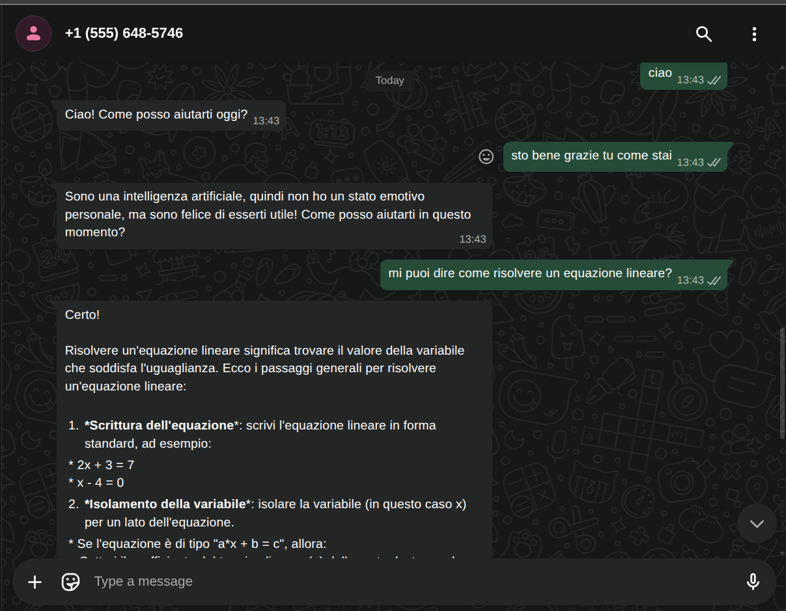
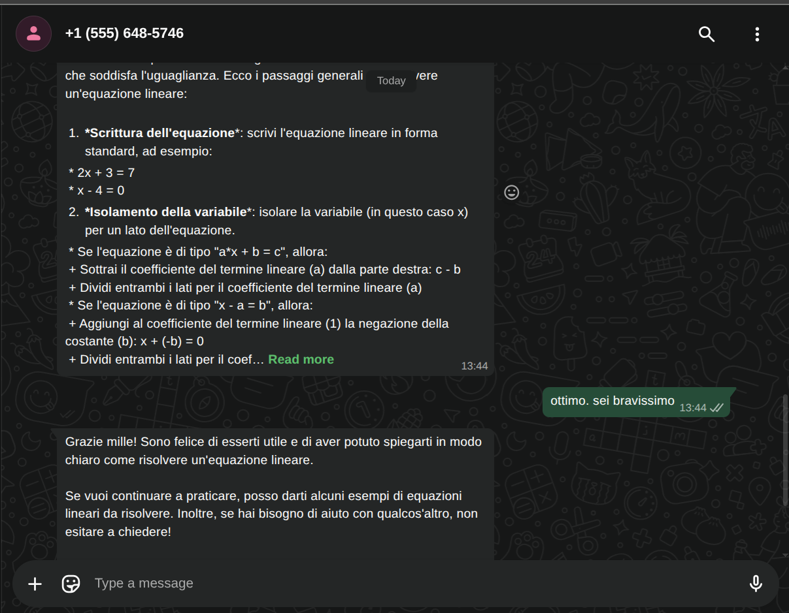
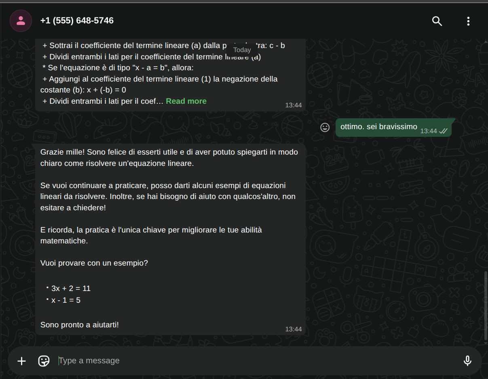
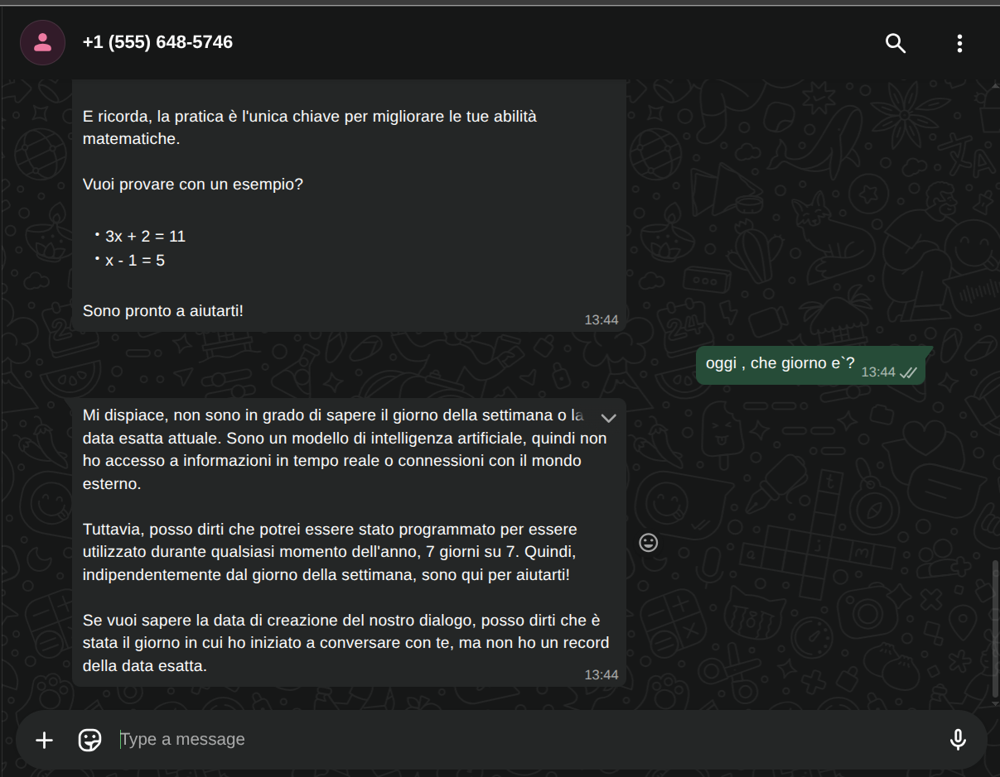

# Development of Uninettuno Student Administration Office 

## Overview
Project provide Fully Orchestrated AI Automated Worflow that helps Uninettuno University Student Office to handle and organize collaborations with students. Project is developed and designed for following business use cases
1. Based on User's request, Watsap BOT has to provide relevant information
2. Watsap Bot is organizzed to deliver general information related to University, its services and public available informations
3. Watsap Bot is organizzed to allow user to book appointments, update and cancel based on their relivant request and according to UNIVERSITY Student Office availiblity.
4. Based on Scheduled meetings, Univerisity Student Office Google Calenders will get notified and managed accordingly

This project demonstrates the implementation of an Agentic AI Workflow using the low-code automation platform [n8n](https://n8n.io?utm_source=chatgpt.com).
The system integrates WhatsApp messaging, a locally hosted Large Language Model through [Ollama](https://ollama.com?utm_source=chatgpt.com), conversational memory, and external tools such as Wikipedia and a Calculator.

The goal of the project is to showcase how an AI Agent can autonomously interact with users, maintain conversational context, use external tools when needed, and generate intelligent responses inside a messaging platform.

---
**PLEASE REFER TO JSON FILE ATTACHED : DOWNLOAD AND OPEN IT IN N8N PLATFORM TO GET TECHNICAL INSIGHTS** [Scarica il documento](Intelligent_WatsapBot_Uninettuno_Segreteria/Fully_Autonomous_WatsapBOT.json)

# Architecture


# Images shows Real Conversation between Watsap BOT and Users
 
 
 
 


The workflow is composed of the following nodes:

| Component         | Description                                          |
| ----------------- | ---------------------------------------------------- |
| WhatsApp Trigger  | Receives incoming WhatsApp messages                  |
| AI Agent          | Main orchestration node                              |
| Ollama Chat Model | Local LLM used for reasoning and response generation |
| Simple Memory     | Stores conversational context                        |
| Wikipedia Tool    | Retrieves external knowledge                         |
| Calculator Tool   | Performs mathematical operations                     |
| Send Message      | Sends AI responses back to WhatsApp                  |

---

# Workflow Description

## 1. WhatsApp Trigger

The workflow starts when a user sends a message through WhatsApp.

The **WhatsApp Trigger** node:

* listens for incoming messages;
* activates the workflow automatically;
* forwards the user input to the AI Agent.

This component acts as the entry point of the system.

---

## 2. AI Agent

The **AI Agent** is the core component of the workflow.

Its responsibilities include:

* understanding user intent;
* deciding whether external tools are required;
* interacting with memory;
* coordinating tool usage;
* generating the final response.

The agent follows an agentic architecture rather than a traditional rule-based chatbot approach.

---

## 3. Ollama Chat Model

The project uses [Ollama](https://ollama.com) to run a local Large Language Model.

Advantages of using a local model:

* improved privacy;
* reduced dependency on cloud APIs;
* local inference capabilities;
* lower operational costs;
* full control over the AI stack.

The model is connected directly to the AI Agent node.

---

## 4. Conversational Memory

The **Simple Memory** node enables short-term conversational memory.

This allows the agent to:

* remember previous messages;
* preserve dialogue continuity;
* provide context-aware responses.

Without memory, every interaction would be stateless.

---

## 5. Wikipedia Tool

The AI Agent can dynamically query Wikipedia whenever external knowledge is needed.

Typical use cases:

* factual questions;
* general knowledge;
* historical information;
* quick topic summaries.

The tool is invoked autonomously by the agent.

---

## 6. Calculator Tool

The Calculator tool enables the agent to solve numerical expressions and mathematical operations.

Examples:

* arithmetic calculations;
* basic equations;
* numerical reasoning support.

This prevents the language model from hallucinating mathematical results.

---

## 7. Send Message

After processing the request, the workflow sends the generated response back to the user via WhatsApp.

This closes the interaction loop.

---

# Execution Flow

The complete execution flow is illustrated below:

1. User sends a WhatsApp message.
2. WhatsApp Trigger captures the request.
3. The AI Agent receives the input.
4. The Ollama model processes the request.
5. The agent optionally:

   * queries Wikipedia;
   * performs calculations;
   * accesses conversational memory.
6. The final response is generated.
7. The response is sent back to WhatsApp.

---

# Technologies Used

* [n8n](https://n8n.io?utm_source=chatgpt.com) — workflow orchestration platform
* [Ollama](https://ollama.com?utm_source=chatgpt.com) — local LLM runtime
* [WhatsApp Business Platform](https://developers.facebook.com/docs/whatsapp?utm_source=chatgpt.com) — messaging integration
* Wikipedia API — external knowledge retrieval
* AI Agent nodes — autonomous reasoning and tool orchestration

---

# Project Goals

This project was designed to explore:

* Agentic AI architectures;
* low-code AI automation;
* tool-augmented LLM systems;
* conversational AI workflows;
* integration between messaging platforms and local AI models.

The workflow can be extended into:

* AI customer support systems;
* virtual assistants;
* knowledge assistants;
* multi-tool autonomous agents;
* enterprise automation solutions.

---

# Future Improvements

Potential future enhancements include:

* vector database integration;
* long-term memory;
* Retrieval-Augmented Generation (RAG);
* multi-agent collaboration;
* voice message support;
* document processing;
* API integrations;
* autonomous task execution.

---

# Conclusion

This project demonstrates how modern low-code platforms like [n8n](https://n8n.io?utm_source=chatgpt.com) can be combined with local AI models and external tools to create intelligent, extensible, and production-ready conversational agents.

The implementation highlights the growing potential of Agentic AI systems capable of reasoning, memory handling, and tool usage inside real-world communication environments such as WhatsApp.


## Commando:
```sh
ngrok http 5678
```
```sh
services:
  n8n:
    image: docker.n8n.io/n8nio/n8n
    container_name: n8n
    restart: always
    ports:
      - "5678:5678"
    environment:
      - N8N_HOST=localhost
      - N8N_PORT=5678
      - N8N_PROTOCOL=http
      - NODE_ENV=production
      - TZ=Europe/Rome
      - N8N_RESTRICT_FILE_ACCESS_TO=/home/node/docs;/home/node/.n8n-files
      - WEBHOOK_URL=https://aim-gas-ambush.ngrok-free.dev
    volumes:
      - n8n_data:/home/node/.n8n  
      - ~/n8n_docs_test:/home/node/docs
    extra_hosts:
      - "host.docker.internal:host-gateway"

volumes:
  n8n_data:
```
